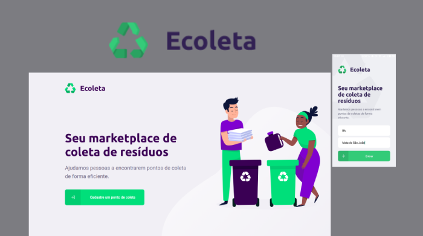

[](https://github.com/dyhalmeida)
[](#)

<h3 align="center"><strong>E-coleta</strong><h3> 
<h4 align="center">A project developed based on international environment week. That aims to connect people to companies that collect specific waste such as light bulbs, batteries, cooking oil, etc.</h4>

<div align="center" >
  
</div>

## 📑 Technologies and modules used

This project was developed with the following technologies:

- ✔️ [React JS](https://reactnative.dev/)
- ✔️ [Leaflet](https://leafletjs.com/)
- ✔️ [RxJS](https://rxjs-dev.firebaseapp.com/)
- ✔️ [Axios](https://github.com/axios/axios#readme)
- ✔️ [Typescript](https://www.typescriptlang.org/)

## 📍 Features

- ✔️ Register a collection point
- ✔️ Choose location of collection point on the map

## 🚀 Getting Started

### 💻 Clone the repository

```bash
git clone https://github.com/dyhalmeida/ecoleta-frontend
```

### 💻 Installation

```bash
# In the project folder run
npm install
```

### 💻 Start Ecoleta mobile

```bash
# Change the src / services / api.ts file to the ip that your api is running on
npm start
```

## 🔓 License

MIT © [Diego Almeida](https://www.linkedin.com/in/dyhalmeida/)
